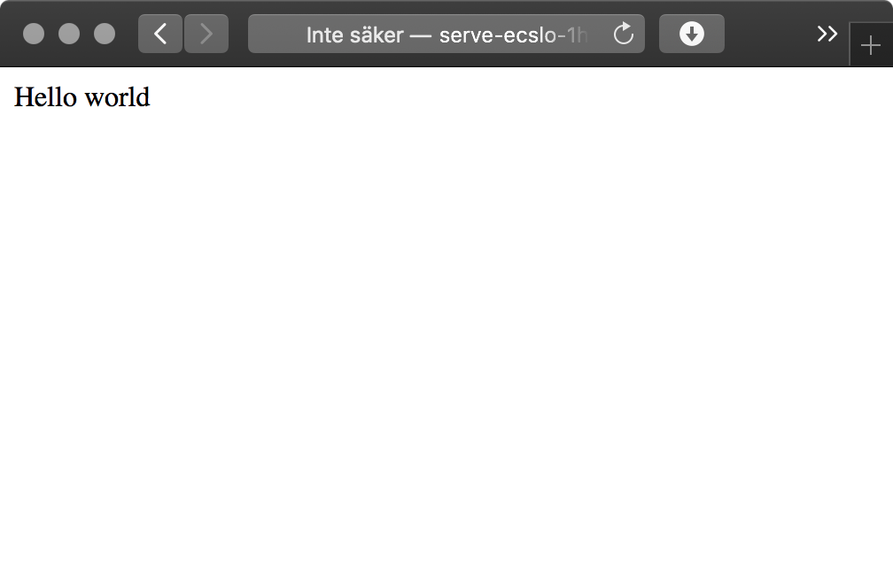

# Node on Fargate (Serverless) Example

This guide is a very slight, helpful repackaging of [Arik Liber's Medium article on running Node on AWS Fargate](https://medium.com/@ariklevliber/aws-fargate-from-start-to-finish-for-a-nodejs-app-9a0e5fbf6361).

Overall, this repo depends on [Serverless Framework](https://www.serverless.com) and the plugin [serverless-fargate-plugin](https://www.npmjs.com/package/serverless-fargate-plugin), whose base configuration is what's used here.

For the application, we first need a small application that listens to requests. A tiny app using Fastify as a server is provided. Then that app needs to be packaged into a container image, and put on a container registry. Such a Dockerfile is also provided. For this example we will put the image on AWS Elastic Container Registry.

## Prerequisites

- You have Docker working on your system, [else read this guide](https://docs.docker.com/install/) or just use [Docker Desktop](https://www.docker.com/products/docker-desktop)
- You have an AWS account or an IAM/SSO user in an AWS account
- You have credentials to create (et cetera) Fargate instances and any required resources such as VPCs and security groups

## Installation and general setup

1. Edit the placeholders in `build-and-push-docker-image.sh` to correspond with your settings
2. Edit the placeholders in `serverless.yml` to correspond with your settings
3. If you have a container image: Run `npm run start` or `yarn start` to both build, push, and deploy (deployment requires that you provide the full path to the container image)
4. If you don't already have a container image: Run `npm run build` or `yarn build`; go to ECR (web GUI or CLI) and create a new repository; grab the image URI; use the image URI in `serverless.yml` to specify image location; then deploy with `npm run deploy` or `yarn deploy`
5. If all goes well and you've deployed with Serverless Framework you can follow the steps under "Setup up Fargate, method 1: Use Serverless Framework" to see how to get your URL

## Detailed instructions

Steps that will be done:

1. You will need to have a Docker image of your own (or know the ARN of one); a tiny Node application is provided in this repo so you can build one of your own
2. You need to get Fargate up and running with that image, either manually or with the help of Serverless Framework

### Build and push the image to a container registry (Example: AWS Elastic Container Registry)

We will run the default ECR steps to login and push. Of course all of this works with Dockerhub or something similar as well, but I'm sticking to the AWS specific services for this context.

- `\$(aws ecr get-login --no-include-email --region {REGION})`
- `docker build -t {PROJECT_NAME} .`
- `docker tag {PROJECT_NAME}:latest {ACCOUNT_NUMBER}.dkr.ecr.{REGION}.amazonaws.com/{PROJECT_NAME}:latest`
- `docker push {ACCOUNT_NUMBER}.dkr.ecr.{REGION}.amazonaws.com/{PROJECT_NAME}:latest`

An included shell script (`build-and-push-docker-image.sh`) runs those commands and a couple of extra helper lines get dependencies, login and build all from the comfort of the root directory.

### Setup up Fargate, method 1: Use Serverless Framework

- Deploy by running `yarn deploy` or `npm run deploy`; this will take a few minutes
- When it's done, go to https://us-east-1.console.aws.amazon.com/ec2/v2/
- Click "Load Balancers" under the "LOAD BALANCING" category
- There should be a load balancer up, click on it
- In the bottom panel, under "Basic configuration" there should be a DNS name, such as `serve-ECSLo-1HXFYPJLNQHP7-794422707.us-east-1.elb.amazonaws.com` – that's your URL!
- Visit the URL and it should show 'Hello world'

### Setup up Fargate, method 2: Manually set up Fargate

Something that should be obvious, but probably is not, is that regular ECS (based on "serverful" EC2 instances) will likely work in any region, but Fargate (as I learned the dull and hard way) is not available _exactly_ everywhere. There should be a choice called "Networking Only" or similar, which is the Fargate option. That's how you see that your region supports it. If you just want to test things out, go for North Virginia (us-east-1).

For now, I will simply point you (again) to the excellent article by [Arik Liber on Medium](https://medium.com/@ariklevliber/aws-fargate-from-start-to-finish-for-a-nodejs-app-9a0e5fbf6361). This is definitely clear enough to give you the steps, with images and all.

NOTE: Based on my Docker image and current config, I needed to add `:8080` to the URL when doing everything the vanilla way and without the load balancer. This is not ideal and would require some change that I've been too lazy to fix yet. Try both with and without the `:8080` added after the URL.

